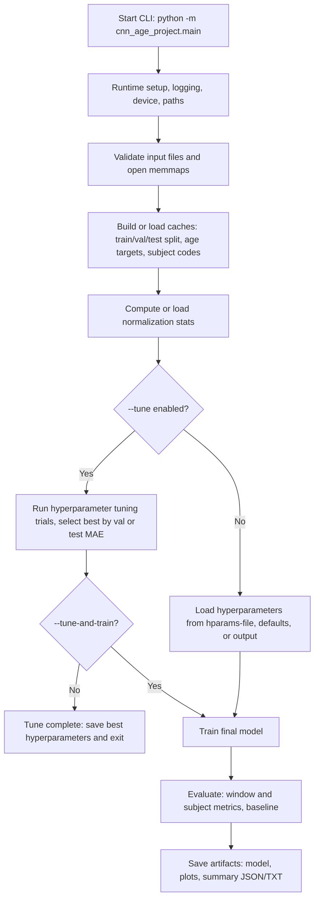

# cfs_cnn_age

Convolutional neural network (CNN) research pipeline for EEG-based age prediction.

## Project Goals

- Train a 1D CNN to predict age from EEG windows.
- Create metrics and artifacts for analysis and reporting.

## Dataset and Data Access

This project uses EEG windows derived from the CFS dataset provided via the
National Sleep Research Resource (NSRR): https://sleepdata.org/

Window extraction for this project was performed through a private
SOM-Neuro-BRAIN (University of Colorado Denver) repository workflow. That
organization and its repositories are private and not open for access requests.
If you already have access to the organization, you can run
`Vibe-Modular-Event-Extraction` to generate windows / fastpack / memmaps. The
produced fastpack contains the files used in `input/`.

## Multiple Instance Learning (MIL) — High-Level Overview

This repository includes a modular MIL implementation that reuses a
pretrained EEG CNN as an instance encoder and learns to aggregate
per-window embeddings into subject-level age predictions.

- Instance encoder: the convolutional feature extractor from
	`cnn_age_project/models/cnn_model.py` (produces a fixed-size embedding
	for each EEG window).
- Aggregation: a gated attention mechanism computes per-instance weights
	from two parallel projections (a `tanh` branch and a `sigmoid` gate),
	multiplies them elementwise, projects to a scalar score, and applies a
	bag-local softmax to produce normalized attention weights.
- Pseudo-bags and batching: training samples per-subject pseudo-bags
	(random subsets of windows).
- Bag regressor: an MLP maps the attention-weighted pooled embedding to
	the final age prediction.

Training modes and practices:

- Encoder frozen: treat the CNN as a fixed feature extractor and train
	only the attention head and regressor.
- End-to-end fine-tune: unfreeze the encoder and jointly optimize the
	encoder + attention + regressor. The trainer supports differential
	learning rates (lower LR for pretrained encoder, higher LR for MIL
	head) to stabilize fine-tuning.
- Subject-wise safety: a runtime check enforces that train and test
	subjects are disjoint to prevent leakage (see the data loader and
	workflow integration).

The MIL code is intentionally modular so the encoder, attention head,
and regressor can be inspected or swapped independently.

## Repository Layout

```text
cfs_cnn_age/
├─ cnn_age_project/
│  ├─ main.py                    # CLI entrypoint
│  ├─ config.py                  # Central configuration
│  ├─ data/
│  │  ├─ data_io.py              # Input validation + memmap/cache loading
│  │  ├─ dataset.py              # Batch iterators + balanced sampling
│  │  └─ preprocessing.py        # Normalization statistics
│  ├─ models/
│  │  ├─ cnn_model.py            # EEG CNN model definition
│  │  └─ mil.py                  # MIL encoder components (Step 1)
│  ├─ training/
│  │  ├─ losses.py               # Loss function selection
│  │  └─ trainer.py              # Tuning + training loops
│  ├─ evaluation/
│  │  └─ evaluation.py           # Metrics + subject-level evaluation
│  ├─ visualization/
│  │  └─ plots.py                # Report plot generation
│  ├─ experiments/
│  │  └─ experiment_logger.py    # Log summaries
│  ├─ workflow/
│  │  ├─ stages.py               # End-to-end orchestration
│  │  └─ types.py                # Dataclasses for stage outputs
│  └─ utils/
│     └─ utils.py                # Logging/progress/device helpers
├─ input/                        # User-provided data
├─ output/                       # Generated artifacts
│  └─ hparams/                   # Tuned hyperparameters
├─ scripts/                      # Utilities (merge_key_files.py, report_train_stratum_window_counts.py, …)
├─ defaults/                     # Optional fallbacks (default_model.pt, default_hyperparameters.json)
├─ requirements-cpu.txt
└─ requirements-gpu.txt
```

## Processing Pipeline



## Setup and Installation

### 1) Create and activate a virtual environment

Windows PowerShell:

```powershell
python -m venv .venv
& .venv\Scripts\Activate.ps1
```

macOS/Linux:

```bash
python -m venv .venv
source .venv/bin/activate
```

### 2) Install dependencies

CPU-only:

```bash
pip install -r requirements-cpu.txt
```

GPU (CUDA 13.0 / cu130):

Prerequisites: an NVIDIA GPU and matching drivers/CUDA runtime (CUDA 13.0 / cu130).
If you need the CUDA runtime, download the CUDA Toolkit: https://developer.nvidia.com/cuda-downloads

Install GPU dependencies:

```bash
pip install -r requirements-gpu.txt
```

Quick verification:

```powershell
nvidia-smi
python -c "import torch; print(torch.cuda.is_available(), torch.version.cuda)"
```

If `torch.cuda.is_available()` prints `False` or a different CUDA version, update
your NVIDIA driver/CUDA runtime to match the PyTorch wheel (cu130), or use the
CPU requirements: `pip install -r requirements-cpu.txt`.

### 3) Prepare Input Files

Before running the CNN pipeline, you need the preprocessed EEG windows in the
format expected by `cfs_cnn_age`. These can be produced using the
Vibe-Modular-Event-Extraction repository belonging to SOM-Neuro-BRAIN.

Steps to generate input files:

#### Run Event Extraction

Extract EEG event windows from your raw dataset:

```bash
python -m sleep_events.main --config config.yaml
```

This creates per-file NPZs containing segmented EEG events.

#### Pack the Extracted Windows

Combine the per-file windows into training-ready arrays using fastpack:

```bash
python -m sleep_events.fastpack \
	--data-dirs "<OUT_DIR>/windows" \
	--pack-dir "<OUT_DIR>/packed_windows" \
	--allowed-events all \
	--fp16
```

Replace `<OUT_DIR>` with your chosen output directory for the pipeline.

#### Locate the Generated Files

If your configuration uses `target_fs: 128` and `window_sec: 10.0`, fastpack
will produce the T=1281 group in `<OUT_DIR>/packed_windows`:

- `X_T1281.fp16.npy` — windowed EEG signals
- `y_T1281.int16.npy` — class/target codes
- `meta_T1281.csv` — maps rows back to source file/subject
- `idx_T1281.int32.npy` — original event-row indices

#### Move the Packed Files into `cfs_cnn_age/input/`

Copy the files from `<OUT_DIR>/packed_windows/T1281/` to this
repository's `input/` folder so the CNN pipeline can access them.

**Train/val/test split (default: auto-split)**

By default the pipeline uses **auto-split**: a 70/15/15 subject-level train/validation/test split. In this mode you do **not** need separate train/test key files.

**Age stratification (default on):** subjects are assigned to age strata (one stratum for ages **below** `stratify_tail_low_max_age`, one collapsed stratum for **≥** `stratify_tail_high_min_age` (default **80**), and **5-year** bands in between—see `cnn_age_project/config.py`). Sparse strata are **merged** with neighbors until each has at least `stratify_min_subjects_per_stratum` subjects so train/val/test can all receive representation. Stratified splits use a **separate memmap cache** suffix (`*_auto_strat*` vs `*_auto*`). Disable with `--no-age-stratified-split` (random subject shuffle).

**CNN training—balanced ages:** by default each epoch **draws a fresh** multiset of training windows with probability proportional to **inverse stratum frequency** (same band definitions as above), similar to PyTorch `WeightedRandomSampler`. The number of draws per epoch is **`cnn_samples_per_epoch`** in `config.py` (default **2,000,000**), capped by the train pool; set to **`None`** in config for the legacy behavior (one draw per train window per epoch). Override on the CLI with **`--cnn-samples-per-epoch N`**; use **`0`** for the full train pool. This **overrides** per-epoch subject-balanced window caps for the CNN loop when enabled; disable weighting entirely with **`--no-age-weighted-window-sampling`**. Use **`scripts/report_train_stratum_window_counts.py`** for a data-driven `n_min × B` suggestion. Default **`epochs`** is **100** so total training exposure stays meaningful when epochs are shorter.

**MIL training—balanced ages (subject-level):** by default each epoch draws train subjects **with replacement** with probability **∝ 1 / (number of train subjects in that age stratum)**, so each stratum gets equal aggregate sampling mass (same strata as above). **Validation/test MIL** still uses **one unweighted bag per subject** (natural age mix). Disable MIL weighting with `--no-mil-inverse-frequency-subject-sampling`.

You must provide subject ages in one of these ways:

- **Option A:** A single key CSV in `input/` named `AgeKey.csv` (or the filename set in config `subject_key_filename`) with columns `SubjectID` and `VariableValue` (age). You can merge train and test key files into one using `scripts/merge_key_files.py`.
- **Option B:** A column in `meta_T1281.csv` named `age`, `Age`, or `VariableValue` that contains age per row (subject ages are inferred from metadata).

If you prefer the legacy split from two key files, run with `--no-auto-split`. Then the pipeline requires:
- `AgeTraining_Key.csv` — training subject key (SubjectID, VariableValue)
- `AgeTesting_Key.csv` — testing subject key (SubjectID, VariableValue)

These key CSVs (or metadata/subject key under auto-split) are used to build per-window age targets and subject mappings (e.g. `y_age_T1281.float32.npy` and `subject_codebook_T1281.json`). The generated arrays must match the naming convention below for `cfs_cnn_age` to run correctly.

**Required memmap files (always):** `X_T1281.fp16.npy`, `y_T1281.int16.npy`, `meta_T1281.csv`. The file `idx_T1281.int32.npy` is optional (used for diagnostics).

**Example input directory (auto-split, single key):**
```text
input/
├─ AgeKey.csv — optional; single subject key (SubjectID, VariableValue) when using auto-split
├─ X_T1281.fp16.npy — windowed EEG signals
├─ y_T1281.int16.npy — window-level target codes
├─ meta_T1281.csv — per-window metadata (may contain age column)
├─ idx_T1281.int32.npy — optional; original event-row indices
└─ README.md — input production notes
```

With `--no-auto-split`, you must also have `AgeTraining_Key.csv` and `AgeTesting_Key.csv` in `input/` (no subject key file is required for splitting in that mode).

## Running the Project

Run from repository root:

```bash
python -m cnn_age_project.main
```

By default the pipeline uses **auto-split** (70/15/15 train/val/test); use `--no-auto-split` to use `AgeTraining_Key.csv` and `AgeTesting_Key.csv` instead. Run to see available CLI flags:

```bash
python -m cnn_age_project.main --help
```

Model execution modes:

- `--model-mode cnn`: run baseline CNN pipeline only (default)
- `--model-mode mil`: run MIL-enhanced pipeline only
- `--model-mode both`: run CNN then MIL in one command and generate comparison artifacts

Examples:

```bash
# Baseline CNN only
python -m cnn_age_project.main --model-mode cnn

# MIL only
python -m cnn_age_project.main --model-mode mil --mil-pretrained-model path/to/cnn_weights.pt

# Run both back-to-back and compare
python -m cnn_age_project.main --model-mode both --mil-pretrained-model path/to/cnn_weights.pt
```

## Configuration

Most defaults are centralized in `cnn_age_project/config.py`, including:

- Input/output file names and directories
- Training hyperparameters (epochs, batch size, learning rate, Huber loss, CNN dropout and weight decay)
- **Split:** auto-split (70/15/15 train/val/test ratios), optional validation key filename
- **Training:** learning rate scheduler (plateau/cosine/none), gradient clipping, early stopping (CNN and MIL), min delta and patience
- Normalization, bootstrap, and reporting controls

For reproducibility, prefer editing config values in one place rather than scattering overrides across scripts. Key CLI overrides include `--auto-split` / `--no-auto-split`, `--validation-key`, and `--hparams-file`.

### Defaults folder

You can place repository-level fallback files into `defaults/` at the repo root. Supported filenames:

- `default_model.pt` — pretrained CNN checkpoint used by MIL when no `--mil-pretrained-model` is provided.
- `default_hyperparameters.json` — hyperparameters used when no `--hparams-file` is provided (checked before `output/hparams/best_hyperparameters.json`).

See `defaults/README.md` for more details.

## Using Hyperparameters and Tuning

**Where hyperparameters come from when not tuning** (first match wins):

1. `--hparams-file PATH` — explicit file you provide
2. `defaults/default_hyperparameters.json` — repository defaults folder
3. `output/hparams/best_hyperparameters.json` — previous tuning run or repo-provided file

To use a custom hyperparameter JSON file:

```bash
python -m cnn_age_project.main --hparams-file path/to/my_hparams.json
```

**Tuning**

- Run hyperparameter tuning with `--tune`. By default the run **stops after saving** the best hyperparameters (no full training). Use `--tune-and-train` to continue into full model training after tuning.
- Best trial is selected by **validation MAE** when a validation set exists (e.g. with auto-split 70/15/15); otherwise by test MAE. The test set is never used for model selection when validation is available.
- Tune only the CNN with `--model-mode cnn`, or MIL with `--model-mode mil`, or both with `--model-mode both`. Use `--tune-backend optuna` for adaptive search or `--tune-backend grid` (default) for shuffled grid search.
- Save results under a named file with `--tune-name`:

```bash
python -m cnn_age_project.main --tune --model-mode cnn --tune-epochs 4 --tune-max-trials 8 --tune-name expA
```

- Without `--tune-name`, the pipeline saves to `output/hparams/best_hyperparameters_<run_tag>.json` (run-unique timestamp), so existing files are not overwritten.
- Tuning trial results are saved alongside the best-hyperparameters file as `<basename>_tuning_results.json` (e.g. `best_hyperparameters_expA_tuning_results.json`).

### Tuning epochs and trials

When running hyperparameter tuning you can control how long each trial runs and how many trials the tuner evaluates.

- `--tune-epochs`: Number of training epochs per trial (default 4). Use smaller values to reduce compute during search.
- `--tune-max-trials`: Maximum number of trials (default 8). Increase for a broader search.
- `--tune-and-train`: After tuning, continue into full model training; without it, the run exits after saving best hyperparameters.

Example (CNN-only tune, then train separately with saved hparams):

```bash
python -m cnn_age_project.main --tune --model-mode cnn --tune-epochs 5 --tune-max-trials 24 --tune-name cnn_encoder
python -m cnn_age_project.main --model-mode cnn --hparams-file output/hparams/best_hyperparameters_cnn_encoder.json
```

## Artifacts Captured

The pipeline stores persistent outputs under `output/`.

### Cached preprocessing artifacts

When using **key-file split** (`--no-auto-split`), caches are named e.g. `split_codes_T1281.uint8.npy`, `y_age_T1281.float32.npy`, `subject_codes_T1281.int32.npy`, `subject_codebook_T1281.json`. When using **auto-split** (default), the same caches use an `_auto` suffix: `split_codes_T1281_auto.uint8.npy`, `y_age_T1281_auto.float32.npy`, etc., so key-file and auto-split caches do not overwrite each other.

- Split codes (train=1, val=3, test=2 per window), age targets, subject codes, subject codebook.

### Tuning artifacts

- Tuning outputs are written to `output/hparams/`.
- Best hyperparameters are loaded from `defaults/default_hyperparameters.json` when present and no `--hparams-file` is given; otherwise from `output/hparams/best_hyperparameters.json`.
- Each tuning run saves `best_hyperparameters_<name|run_tag>.json` and a matching `<basename>_tuning_results.json` in that folder.

### Per-run artifacts (timestamped output folder)

- Model weights: `cnn_age_model_<timestamp>.pt`
- Run summary JSON: `cnn_run_summary_<timestamp>.json`
- Run summary text: `cnn_run_summary_<timestamp>.txt`
- Training/evaluation figure: `cnn_training_report_<timestamp>.png`
- Subject example figure: `cnn_subject_examples_<timestamp>.png`

### Comparison artifacts (when `--model-mode both`)

- `cnn_mil_comparison_<run_tag>.json`
- `cnn_mil_comparison_<run_tag>.txt`
- `cnn_mil_comparison_<run_tag>.png`

Per-model artifacts are also organized into subfolders:

- `output/<run_tag>/cnn/`
- `output/<run_tag>/mil/`
