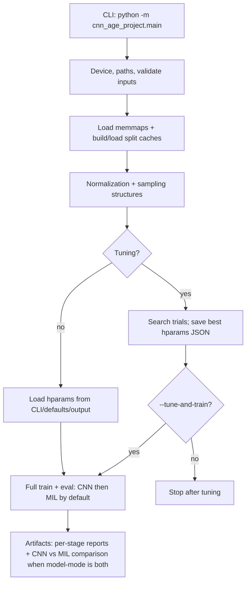

# cfs_cnn_age

**Subject-level age regression** from fixed-length EEG windows using a **two-stage model**: a **1D CNN encoder** on each window, then **multiple-instance learning (MIL)** to aggregate windows per subject into a single predicted age.

## Project goals

- **CNN+MIL model**: learn window embeddings with a CNN, then pool them with gated attention for a **subject-level** age estimate.
- Support **window-level** baselines (`--model-mode cnn`) and **MIL-only** fine-tuning (`--model-mode mil`) when a pretrained encoder already exists.
- Emit metrics, plots, and run summaries, including **CNN vs CNN+MIL** comparison artifacts when both stages run.

## Dataset and data access

This project uses EEG windows derived from the CFS dataset provided via the
National Sleep Research Resource (NSRR): https://sleepdata.org/

Window extraction for this project was performed through a private
SOM-Neuro-BRAIN (University of Colorado Denver) repository workflow. That
organization and its repositories are private and not open for access requests.
If you already have access to the organization, you can run
`Vibe-Modular-Event-Extraction` to generate windows / fastpack / memmaps. The
produced fastpack contains the files used in `input/`.

## CNN+MIL Model Overview
The **primary model** is CNN + MIL: windows are instances; subjects are bags.

- **Encoder (CNN):** `cnn_age_project/models/cnn_model.py` maps each window to a fixed embedding (the “instance” representation).
- **Aggregation (MIL):** `cnn_age_project/models/mil.py` — gated attention over windows in a bag (weights bag-normalized) plus an MLP regressor for predicted age.
- **Training:** MIL training uses stochastic **subject pseudo-bags** (random window subsets). Training can use **inverse-frequency stratum sampling** over subjects so rare age bands get more weight; **validation/test** MIL eval uses **one bag per subject**. The encoder can be fine-tuned with **separate learning rates** for CNN vs MIL head (`cnn_age_project/training/trainer.py`).
- **Subject leakage:** Train/val/test subjects are disjoint at the workflow level.

## Repository layout

```text
cfs_cnn_age/
├─ cnn_age_project/
│  ├─ main.py                 # CLI entrypoint
│  ├─ config.py               # Central configuration
│  ├─ data/                   # I/O, splits, batching, strata
│  ├─ models/                 # CNN encoder + MIL bag model
│  ├─ training/               # Loops, tuning, losses
│  ├─ evaluation/             # Metrics
│  ├─ visualization/          # Training + comparison plots
│  ├─ experiments/            # Hyperparameter merge/save helpers
│  ├─ workflow/               # End-to-end stages
│  └─ utils/
├─ input/                     # Memmaps + CSVs (you provide)
├─ output/                    # Caches, runs, tuned hparams
│  └─ hparams/
├─ defaults/                  # Optional default_model.pt, default_*_hyperparameters.json
├─ scripts/                   # Small utilities
├─ requirements-cpu.txt
└─ requirements-gpu.txt
```

## Processing pipeline




## Setup and installation

**Python 3.10+** recommended. From the repo root:

```powershell
python -m venv .venv
.\.venv\Scripts\Activate.ps1
```

**Dependencies**

- **CPU:** `pip install -r requirements-cpu.txt`
- **GPU (CUDA 13.0 / cu130 wheels, see file header):** `pip install -r requirements-gpu.txt`

Verify GPU:

```powershell
nvidia-smi
python -c "import torch; print(torch.cuda.is_available(), torch.version.cuda)"
```

If CUDA is unavailable, use the CPU requirements file or install a PyTorch wheel matching your CUDA/driver.

## Input files (what goes in `input/`)

**Assumptions used below:** auto-split is **on** (default), age-stratified train/val/test is **on** (default), and memmap names match the default window length tag `T1281` (configurable in `cnn_age_project/config.py`).

### Required memmaps

Place these in `input/` (names match `config.py`):


| File                | Role                                                          |
| ------------------- | ------------------------------------------------------------- |
| `X_T1281.fp16.npy`  | Window tensor (float16)                                       |
| `y_T1281.int16.npy` | Window-level class/code column                                |
| `meta_T1281.csv`    | Per-row metadata (`subject_id` required; optional age column) |


### Optional


| File                  | Role                                    |
| --------------------- | --------------------------------------- |
| `idx_T1281.int32.npy` | Original row indices (diagnostics only) |


### Subject ages and splits

For **auto-split**, the pipeline needs a **subject → age** map, resolved in order:

1. `config.py` → `subject_key_filename` if set and the file exists under `input/`, else
2. `input/AgeKey.csv` if present, else
3. **Age in metadata** (`age`, `Age`, or `VariableValue` on `subject_id` rows).

Key CSV format: columns `SubjectID` and `VariableValue` (age in years).

Auto-split assigns **70% / 15% / 15%** of **subjects** to train / val / test (ratios configurable in `config.py`). Age stratification merges sparse bands into strata before splitting; disable with `--no-age-stratified-split`.

**Legacy split (`--no-auto-split`):** requires `AgeTraining_Key.csv` and `AgeTesting_Key.csv` in `input/`. Optional `--validation-key AgeValidation_Key.csv` (in `input/`) adds a disjoint validation set for early stopping and metrics.

With **auto-split** (default), train/val/test are all derived from the key/metadata ages; `--validation-key` is not used—validation is the middle fold of the configured ratios.

## Running the project

Always run from the **repository root**:

```bash
python -m cnn_age_project.main --help
```

### Model modes

| Mode | Behavior |
| --- | --- |
| `both` (default) | Full model: train the CNN, save weights, then train MIL on that run’s encoder (no separate `--mil-pretrained-model` needed). Writes CNN vs MIL comparison artifacts. |
| `cnn` | Encoder-only run: window-level age prediction (useful for ablations or tuning the CNN in isolation). |
| `mil` | MIL-only fine-tuning: load a pretrained encoder from `--mil-pretrained-model` or `defaults/default_model.pt`. |

Examples:

```bash
# Default: CNN then MIL (full model)
python -m cnn_age_project.main

# Explicit hyperparameters for each stage
python -m cnn_age_project.main --cnn-hparams-file defaults/default_cnn_hyperparameters.json --mil-hparams-file defaults/default_mil_hyperparameters.json

# Encoder-only or MIL-only
python -m cnn_age_project.main --model-mode cnn
python -m cnn_age_project.main --model-mode mil --mil-pretrained-model path/to/cnn_weights.pt
```

**CNN stage (when `both` or `cnn`):** age-weighted **window** sampling (inverse stratum frequency) via `cnn_samples_per_epoch` in `config.py` (override: `--cnn-samples-per-epoch`; `0` = full train pool). Disable weighting: `--no-age-weighted-window-sampling`.

**MIL stage (when `both` or `mil`):** inverse-frequency **subject** sampling for training bags by default; disable with `--no-mil-inverse-frequency-subject-sampling`. Subject draws: `--mil-subject-draws-multiplier` / `--mil-subject-draws-per-epoch` (see CLI table).

**Legacy flag:** `--mil-finetune` still maps `--model-mode cnn` → `mil` for old scripts. If you only need MIL-only, pass `--model-mode mil` explicitly (the default is now `both`, not `cnn`).

## Configuration

`cnn_age_project/config.py` holds **defaults**: epochs, batch size, LR, Huber loss, split ratios, stratification bands, MIL bag sizes, early stopping, bootstrap, paths, etc.

**CLI** overrides the most common knobs (see table at the end). **Hyperparameters JSON** (from `defaults/` or `--hparams-file`) merges in **after** code defaults; see `defaults/README.md` for merge order (`default_hyperparameters.json` → `default_cnn_hyperparameters.json` → `default_mil_hyperparameters.json`).

## Hyperparameters and tuning

### Where trained hyperparameters come from (no `--tune`)

1. Code defaults in `config.py` (and `get_default_hyperparameters` in `experiments/experiment_logger.py`).
2. Merge of `defaults/default_*.json` files.
3. `--hparams-file PATH` (or `--cnn-hparams-file` / `--mil-hparams-file` when running `both`).
4. If no `--hparams-file`, `output/hparams/best_hyperparameters.json` when present.

### Tuning mode (`--tune`)

- **Default backend:** `--tune-backend optuna` (TPE sampler; use `--tune-backend grid` for shuffled grid search).  
- **Selection metric:** **validation MAE** when a validation set exists (window MAE for CNN; subject-bag MAE for MIL); otherwise test MAE. Test is **not** used for selection when val is available.  
- `--tune` normally **stops after saving** the best JSON; add `--tune-and-train` to continue into full training in the same run.  
- `--tune-name expA` → `output/hparams/best_hyperparameters_expA.json` (+ `best_hyperparameters_expA_tuning_results.json`). Without `--tune-name`, a run-timestamped filename is used so nothing is overwritten.

**Modes:** default `both`; or `--model-mode cnn` | `mil`.  

- **both (joint tune):** each trial runs **short CNN** then **short MIL**; the objective is `0.5 × (CNN selection MAE + MIL selection MAE)`. That optimizes the **full pipeline** jointly, not necessarily the best **CNN-only** hyperparameters—use `--tune --model-mode cnn` if you need a dedicated encoder search.  
- **mil tuning:** loads a pretrained CNN encoder from `--mil-pretrained-model` or `defaults/default_model.pt` (the in-trial CNN from a `both` trial is **not** passed into the MIL tuner—use a checkpoint path).

**Optuna (default):** `--optuna-sampler`, `--optuna-pruner` (`median` / `none`), `--optuna-startup-trials`, `--optuna-seed`, optional `--optuna-storage` + `--optuna-study-name` for parallel workers sharing one study.

**Trial length:** `--tune-epochs` (default 4), `--tune-max-trials` (default 8).

Example:

```bash
python -m cnn_age_project.main --tune --model-mode cnn --tune-epochs 8 --tune-max-trials 32 --tune-name my_search
python -m cnn_age_project.main --model-mode cnn --hparams-file output/hparams/best_hyperparameters_my_search.json
```

## Artifacts

### Caches (`output/`)

Generated once per split/metadata convention; names include `T1281` and `_auto` or `_auto_strat` for age-stratified auto-split. Examples: `split_codes_*.npy`, `y_age_*.float32.npy`, `subject_codes_*.npy`, `subject_codebook_*.json`.

### Tuning

`output/hparams/best_hyperparameters.json` or `best_hyperparameters_<tune_name>.json`, plus matching `*_tuning_results.json`.

### Per run

Each run uses a timestamped folder under `output/<run_tag>/`. The default `both` run writes `cnn/` and `mil/` subfolders (one stage each).

Typical files (names include `run_tag` and model label):

- Model weights: `cnn_age_model_<label>_<run_tag>.pt`
- `cnn_run_summary_<...>.json` / `.txt`
- `cnn_training_report_<...>.png`, `cnn_subject_examples_<...>.png`
- MIL: `mil_attention_best_bag.png` (when applicable)

**CNN vs MIL comparison** (default `both` runs): `cnn_mil_comparison_<run_tag>.{json,txt,png}` at the run root.

## CLI reference

Grouped flags (see `python -m cnn_age_project.main --help` for defaults). *Path* = repo-relative or absolute.


| Group                       | Arguments                                                                      | Notes                                                          |
| --------------------------- | ------------------------------------------------------------------------------ | -------------------------------------------------------------- |
| **Mode / legacy**           | `--model-mode {cnn,mil,both}`                                                  | Default: `both` (full CNN+MIL).                                |
|                             | `--mil-finetune`                                                               | Legacy: with `--model-mode cnn`, switches to `mil`.            |
| **Tuning**                  | `--tune`, `--tune-and-train`                                                   | Tuning only vs continue training.                              |
|                             | `--tune-epochs`, `--tune-max-trials`                                           | Short runs per trial.                                          |
|                             | `--tune-backend {optuna,grid}`                                                 | Default: optuna                                                |
|                             | `--tune-name`                                                                  | Stable output filenames.                                       |
| **Optuna**                  | `--optuna-sampler {tpe,random}`                                                | TPE default.                                                   |
|                             | `--optuna-pruner {none,median}`                                                | Median default; epoch-level reporting when pruning.            |
|                             | `--optuna-startup-trials`                                                      | TPE warmup; also MedianPruner warmup.                          |
|                             | `--optuna-seed`                                                                |                                                                |
|                             | `--optuna-storage`, `--optuna-study-name`                                      | Shared DB / parallel workers.                                  |
| **Hyperparameters**         | `--hparams-file`                                                               | Single JSON for merged keys.                                   |
|                             | `--cnn-hparams-file`, `--mil-hparams-file`                                     | Per-stage overrides in `both` mode.                            |
| **Split / keys**            | `--auto-split` / `--no-auto-split`                                             | Default: auto 70/15/15 subjects.                               |
|                             | `--validation-key`                                                             | Only with `--no-auto-split`: val CSV in `input/`.              |
|                             | `--no-age-stratified-split`                                                    | Random subject split instead of strata (auto-split only).      |
| **CNN sampling**            | `--no-age-weighted-window-sampling`                                            | Uniform train windows (subject cap still applies).             |
|                             | `--cnn-samples-per-epoch`                                                      | `0` = full train pool per epoch.                               |
| **MIL sampling / schedule** | `--no-mil-inverse-frequency-subject-sampling`                                  | One bag per subject per epoch.                                 |
|                             | `--mil-subject-draws-per-epoch`, `--mil-subject-draws-multiplier`              | Multiplier × eligible train subjects.                          |
| **MIL checkpoint / arch**   | `--mil-pretrained-model`                                                       | Required for `mil` alone; omit for `both` (uses CNN from run). |
|                             | `--mil-attention-dim`, `--mil-attention-dropout`                               |                                                                |
|                             | `--mil-pooling-type {gated,mean}`                                              |                                                                |
|                             | `--mil-regressor-hidden-dim`, `--mil-regressor-dropout`                        |                                                                |
|                             | `--mil-bag-batch-size`                                                         | Bags per optimizer step.                                       |
|                             | `--mil-pseudo-bag-min-windows`, `--mil-pseudo-bag-max-windows`                 |                                                                |
|                             | `--mil-sampling-strategy {random,sequential}`                                  |                                                                |
|                             | `--mil-allow-replacement-when-small` / `--no-mil-allow-replacement-when-small` |                                                                |
|                             | `--mil-encoder-lr`, `--mil-head-lr`, `--mil-weight-decay`                      |                                                                |
| **MIL early stopping**      | `--mil-early-stopping-patience`, `--mil-early-stopping-min-epochs`             |                                                                |
|                             | `--mil-early-stopping-monitor {auto,train,val}`                                | `auto` uses val when val exists.                               |


