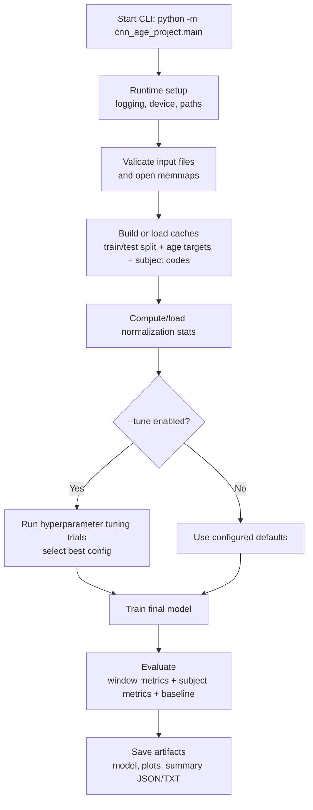

# cfs_cnn_age

Convolutional neural network (CNN) research pipeline for EEG-based age prediction.

## Project Goals

- Train a 1D CNN to predict age from EEG windows.
- Create metrics and artifacts for analysis and reporting.

## Dataset and Data Access

This project uses EEG windows derived from the CFS dataset provided via the
National Sleep Research Resource (NSRR): https://sleepdata.org/

Window extraction for this project was performed through a private
SOM-Neuro-BRAIN (University of Colorado Denver) repository workflow. That
organization and its repositories are private and not open for access requests.
If you already have access to the organization, you can run
`Vibe-Modular-Event-Extration` to generate windows / fastpack / memmaps. The
produced fastpack contains the files used in `input/`.

## Repository Layout

```text
cfs_cnn_age/
├─ cnn_age_project/
│  ├─ main.py                    # CLI entrypoint
│  ├─ config.py                  # Central configuration
│  ├─ data/
│  │  ├─ data_io.py              # Input validation + memmap/cache loading
│  │  ├─ dataset.py              # Batch iterators + balanced sampling
│  │  └─ preprocessing.py        # Normalization statistics
│  ├─ models/
│  │  ├─ cnn_model.py            # EEG CNN model definition
│  │  └─ mil.py                  # MIL encoder components (Step 1)
│  ├─ training/
│  │  ├─ losses.py               # Loss function selection
│  │  └─ trainer.py              # Tuning + training loops
│  ├─ evaluation/
│  │  └─ evaluation.py           # Metrics + subject-level evaluation
│  ├─ visualization/
│  │  └─ plots.py                # Report plot generation
│  ├─ experiments/
│  │  └─ experiment_logger.py    # Log summaries
│  ├─ workflow/
│  │  ├─ stages.py               # End-to-end orchestration
│  │  └─ types.py                # Dataclasses for stage outputs
│  └─ utils/
│     └─ utils.py                # Logging/progress/device helpers
├─ input/                        # User-provided data
├─ output/                       # Generated artifacts
│  └─ hparams/                   # Tuned hyperparameters
├─ requirements-cpu.txt
└─ requirements-gpu.txt
```

## Processing Pipeline



## Setup and Installation

### 1) Create and activate a virtual environment

Windows PowerShell:

```powershell
python -m venv .venv
& .venv\Scripts\Activate.ps1
```

macOS/Linux:

```bash
python -m venv .venv
source .venv/bin/activate
```

### 2) Install dependencies

CPU-only:

```bash
pip install -r requirements-cpu.txt
```

GPU (CUDA 13.0 / cu130)

Prerequisites: an NVIDIA GPU and matching drivers/CUDA runtime (CUDA 13.0 / cu130).
If you need the CUDA runtime, download the CUDA Toolkit: https://developer.nvidia.com/cuda-downloads

Install GPU dependencies:

```bash
pip install -r requirements-gpu.txt
```

Quick verification:

```powershell
nvidia-smi
python -c "import torch; print(torch.cuda.is_available(), torch.version.cuda)"
```

If `torch.cuda.is_available()` prints `False` or a different CUDA version, update
your NVIDIA driver/CUDA runtime to match the PyTorch wheel (cu130), or use the
CPU requirements: `pip install -r requirements-cpu.txt`.

### 3) Prepare Input Files

Before running the CNN pipeline, you need the preprocessed EEG windows in the
format expected by `cfs_cnn_age`. These can be produced using the
Vibe-Modular-Event-Extraction repository belonging to SOM-Neuro-BRAIN.

Steps to generate the input files:

#### Run Event Extraction

Extract EEG event windows from your raw dataset:

```bash
python -m sleep_events.main --config config.yaml
```

This creates per-file NPZs containing segmented EEG events.

#### Pack the Extracted Windows

Combine the per-file windows into training-ready arrays using fastpack:

```bash
python -m sleep_events.fastpack \
	--data-dirs "<OUT_DIR>/windows" \
	--pack-dir "<OUT_DIR>/packed_windows" \
	--allowed-events all \
	--fp16
```

Replace `<OUT_DIR>` with your chosen output directory for the pipeline.

#### Locate the Generated Files

If your configuration uses `target_fs: 128` and `window_sec: 10.0`, fastpack
will produce the T=1281 group in `<OUT_DIR>/packed_windows`:

- `X_T1281.fp16.npy` — windowed EEG signals
- `y_T1281.int16.npy` — class/target codes
- `meta_T1281.csv` — maps rows back to source file/subject
- `idx_T1281.int32.npy` — original event-row indices

#### Move the Packed Files into `cfs_cnn_age/input/`

Copy the files from `<OUT_DIR>/packed_windows/T1281/` to this
repositories `input/` folder so the CNN pipeline can access them.

Place these files (subject-level key files for training and testing sets) in `input/`
- `AgeTraining_Key.csv`
- `AgeTesting_Key.csv`

These key CSVs are used to build the per-window age targets and subject mappings (for example, `y_age_T1281.float32.npy` and `subject_codebook_T1281.json`).
Note: The generated arrays must match the naming convention above for
`cfs_cnn_age` to run correctly.

In the end your input directory should contain these files:
```text
input/
├─ AgeTraining_Key.csv — training subject key
├─ AgeTesting_Key.csv — testing subject key
├─ X_T1281.fp16.npy — windowed EEG signals
├─ y_T1281.int16.npy — window-level target codes
├─ meta_T1281.csv — per-window metadata
├─ idx_T1281.int32.npy — original event-row indices
└─ README.md — input production notes
```

## Running the Project

Run from repository root:

```bash
python -m cnn_age_project.main
```

Run to see available CLI flags:

```bash
python -m cnn_age_project.main --help
```

Model execution modes:

- `--model-mode cnn`: run baseline CNN pipeline only (default)
- `--model-mode mil`: run MIL-enhanced pipeline only
- `--model-mode both`: run CNN then MIL in one command and generate comparison artifacts

Examples:

```bash
# Baseline CNN only
python -m cnn_age_project.main --model-mode cnn

# MIL only
python -m cnn_age_project.main --model-mode mil --mil-pretrained-model path/to/cnn_weights.pt

# Run both back-to-back and compare
python -m cnn_age_project.main --model-mode both --mil-pretrained-model path/to/cnn_weights.pt
```

## Configuration

Most defaults are centralized in `cnn_age_project/config.py`, including:

- Input/output file names and directories
- Training hyperparameters (epochs, batch size, learning rate)
- Optional tuning and early stopping behavior
- Normalization, bootstrap, and reporting controls

For reproducibility, prefer editing config values in one place rather than
scattering overrides across scripts.

## Multiple Instance Learning (MIL) — High-Level Overview

This repository includes a modular MIL implementation that reuses a
pretrained EEG CNN as an instance encoder and learns to aggregate
per-window embeddings into subject-level age predictions.

- Instance encoder: the convolutional feature extractor from
	`cnn_age_project/models/cnn_model.py` (produces a fixed-size embedding
	for each EEG window).
- Aggregation: a gated attention mechanism computes per-instance weights
	from two parallel projections (a `tanh` branch and a `sigmoid` gate),
	multiplies them elementwise, projects to a scalar score, and applies a
	bag-local softmax to produce normalized attention weights.
- Pseudo-bags and batching: training samples per-subject pseudo-bags
	(random subsets of windows).
- Bag regressor: an MLP maps the attention-weighted pooled embedding to
	the final age prediction.

Training modes and practices:

- Encoder frozen: treat the CNN as a fixed feature extractor and train
	only the attention head and regressor.
- End-to-end fine-tune: unfreeze the encoder and jointly optimize the
	encoder + attention + regressor. The trainer supports differential
	learning rates (lower LR for pretrained encoder, higher LR for MIL
	head) to stabilize fine-tuning.
- Subject-wise safety: a runtime check enforces that train and test
	subjects are disjoint to prevent leakage (see the data loader and
	workflow integration).

The MIL code is intentionally modular so the encoder, attention head,
and regressor can be inspected or swapped independently.

Defaults folder

You can place repository-level fallback files into `defaults/` at the repo
root. Supported filenames:

- `default_model.pt` — pretrained CNN checkpoint used by MIL when no
	`--mil-pretrained-model` is provided.
- `default_hyperparameters.json` — default hyperparameters used when no
	`--hparams-file` is provided.

See `defaults/README.md` for more details.

## Using Hyperparameters and Tuning

The project provides a repository `output/hparams/best_hyperparameters.json` you can use to
train quickly without running costly tuning. Behavior and CLI options:

- Use the repo-provided hyperparameters (if present at `output/hparams/best_hyperparameters.json`) by default when not tuning.
- To use a custom hyperparameter JSON file, pass `--hparams-file`:

```bash
python -m cnn_age_project.main --hparams-file path/to/my_hparams.json
```

- To run hyperparameter tuning and save the results with a custom name use
	`--tune-name`:

```bash
python -m cnn_age_project.main --tune --tune-epochs 4 --tune-max-trials 8 --tune-name expA
```

- If you run tuning without `--tune-name`, the pipeline will save tuned
	hyperparameters to a run-unique file under `output/hparams/` named
	`best_hyperparameters_<run_tag>.json` (where `<run_tag>` is the timestamp),
	so it will not overwrite the repository `output/hparams/best_hyperparameters.json`.

- Tuning trial results are saved alongside the chosen best-hyperparameters file
	as `<basename>_tuning_results.json` (for example
	`best_hyperparameters_expA_tuning_results.json`).

### Tuning epochs and trials

When running hyperparameter tuning you can control how long each trial runs
and how many trials the tuner evaluates.

- `--tune-epochs`: Number of training epochs per trial (overrides the config
	default for tuning). During search prefer small values to reduce compute;

```bash
python -m cnn_age_project.main --tune --tune-epochs 4
```

- `--tune-max-trials`: Maximum number of tuning trials to evaluate. Increase
	for a broader search, decrease to save compute;

```bash
python -m cnn_age_project.main --tune --tune-max-trials 24
```

- You can combine both tuning flags (and the optional `--tune-name`) in a
	single command;

```bash
python -m cnn_age_project.main --tune --tune-epochs 4 --tune-max-trials 24 --tune-name expA
```

## Artifacts Captured

The pipeline stores persistent outputs under `output/`.

### Cached preprocessing artifacts

- `split_codes_T1281.uint8.npy` (train/test split per window)
- `y_age_T1281.float32.npy` (window-level age targets)
- `subject_codes_T1281.int32.npy` (window-to-subject mapping)
- `subject_codebook_T1281.json` (subject code lookup)

### Tuning artifacts

- Tuning outputs are written to `output/hparams/`.
- Repository default hyperparameters live at
  `output/hparams/best_hyperparameters.json`.
- Each tuning run saves a `best_hyperparameters_<name|run_tag>.json` and a
	matching `<basename>_tuning_results.json` file inside that folder.

### Per-run artifacts (timestamped output folder)

- Model weights: `cnn_age_model_<timestamp>.pt`
- Run summary JSON: `cnn_run_summary_<timestamp>.json`
- Run summary text: `cnn_run_summary_<timestamp>.txt`
- Training/evaluation figure: `cnn_training_report_<timestamp>.png`
- Subject example figure: `cnn_subject_examples_<timestamp>.png`

### Comparison artifacts (when `--model-mode both`)

- `cnn_mil_comparison_<run_tag>.json`
- `cnn_mil_comparison_<run_tag>.txt`
- `cnn_mil_comparison_<run_tag>.png`

Per-model artifacts are also organized into subfolders:

- `output/<run_tag>/cnn/`
- `output/<run_tag>/mil/`
